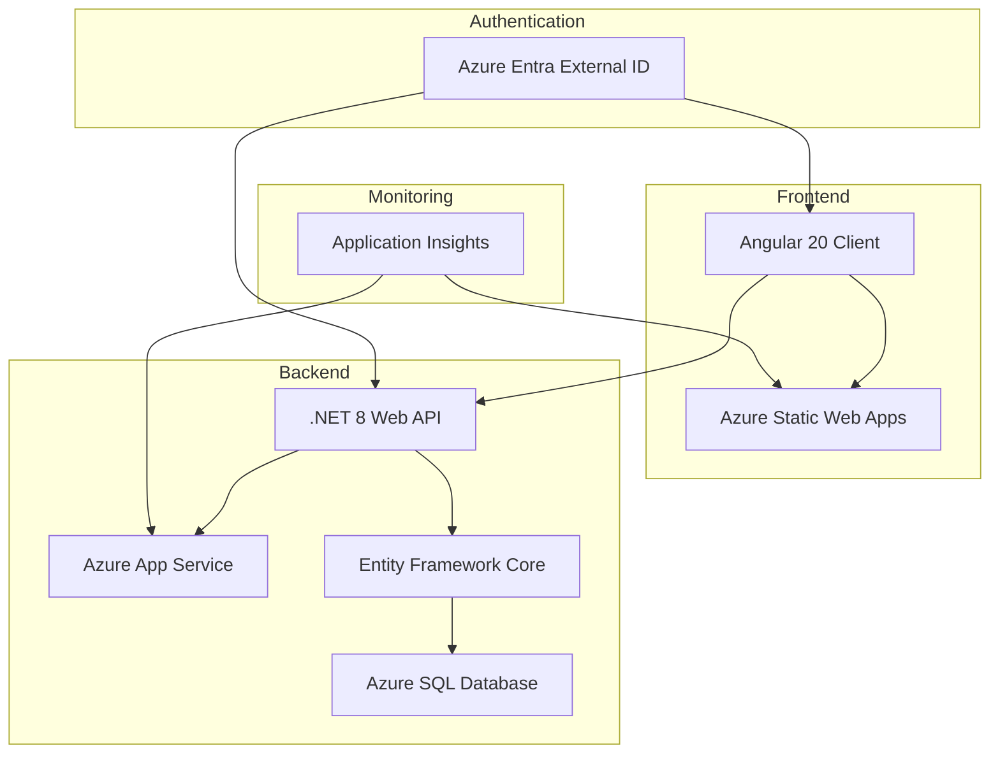
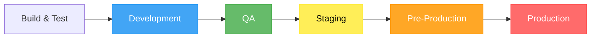

# GlassLewis Platform

<div align="center">


**🚀 A modern, secure, and scalable web platform built with .NET 8 and Angular**

[🔗 Live Demo](https://dev.client.glasslewis.mamoorkhan.com/)

</div>

---

## 🌟 Features

<table>
<tr>
<td>

### 🔐 **Enterprise Security**
- Azure Entra External ID authentication
- JWT token-based authorization
- Multi-factor authentication support

</td>
<td>

### ⚡ **High Performance**
- .NET 8 Web API backend
- Angular 20 frontend with SSR
- Entity Framework Core optimization
- Azure cloud infrastructure

</td>
</tr>
<tr>
<td>

### 🧪 **Quality Assurance**
- Comprehensive test coverage (Unit, Integration, E2E)
- Automated CI/CD with GitHub Actions

</td>
<td>

### 🔄 **DevOps Ready**
- Infrastructure as Code with Bicep
- Automated testing pipelines

</td>
</tr>
</table>

## 🏗️ Architecture



## 🛠️ Tech Stack

### Backend


### Frontend


### Testing


### Infrastructure


## 🚀 Quick Start

### Prerequisites

Before you begin, ensure you have the following installed:

- [.NET 8 SDK](https://dotnet.microsoft.com/download/dotnet/8.0) (≥ 8.0.0)
- [Node.js](https://nodejs.org/) (≥ 18.x) and npm
- [Angular CLI](https://angular.io/cli) (≥ 20.x)
- [Azure CLI](https://docs.microsoft.com/en-us/cli/azure/install-azure-cli) (for deployment)
- [Git](https://git-scm.com/)
- **Azure subscription** with admin privileges
- **Azure Entra External ID tenant** (or ability to create one)

### 🔑 Azure Setup (First Time Only)

#### Step 1: Create Azure Entra App Registrations

You'll need **two separate app registrations** - one for the API and one for the Angular client.

##### 🔹 **API App Registration**

1. **Navigate to Azure Portal**
   - Go to [Azure Portal](https://portal.azure.com)
   - Select **Microsoft Entra ID** → **App registrations** → **New registration**

2. **Configure API App Registration**
   ```
   Name: glasslewis-api-{environment}
   Supported account types: Accounts in this organizational directory only
   Redirect URI: Leave blank for now
   ```

3. **Configure API Permissions & Expose API**
   - Go to **Expose an API** → **Add a scope**
   ```
   Application ID URI: api://your-api-client-id
   Scope name: Company.Read
   Admin consent display name: Read company data
   Admin consent description: Allows the application to read company information
   State: Enabled
   ```
   - Add another scope:
   ```
   Scope name: Company.ReadWrite
   Admin consent display name: Read and write company data
   Admin consent description: Allows the application to read and write company information
   State: Enabled
   ```

4. **Note down these values** (you'll need them later):
   ```
   API Application (client) ID: [copy this]
   Directory (tenant) ID: [copy this]
   ```

##### 🔹 **Client App Registration**

1. **Create Second App Registration**
   ```
   Name: glasslewis-client-{environment}
   Supported account types: Accounts in this organizational directory only
   Redirect URI: 
     - Type: Single-page application (SPA)
     - URI: http://localhost:4200 (for local development)
   ```

2. **Add Additional Redirect URIs** (after creation)
   - Go to **Authentication** → **Add URI**
   ```
   For development: http://localhost:4200
   For production: https://your-production-domain.com
   ```

3. **Configure API Permissions**
   - Go to **API permissions** → **Add a permission**
   - **My APIs** → Select your API app → **Delegated permissions**
   - Select: `Company.Read` and `Company.ReadWrite`
   - **Grant admin consent** for your organization

4. **Configure Token Configuration** (Optional but recommended)
   - Go to **Token configuration** → **Add optional claim**
   - **ID tokens**: Select `email`, `family_name`, `given_name`
   - **Access tokens**: Select `email`

5. **Note down these values**:
   ```
   Client Application (client) ID: [copy this]
   Directory (tenant) ID: [same as API]
   ```

#### Step 2: Create Service Principal for GitHub Actions

1. **Create App Registration for Deployment**
   ```
   Name: glasslewis-github-actions
   Supported account types: Accounts in this organizational directory only
   Redirect URI: None
   ```

2. **Create Client Secret**
   - Go to **Certificates & secrets** → **New client secret**
   ```
   Description: GitHub Actions Deployment
   Expires: 24 months (recommended)
   ```
   - **⚠️ Important**: Copy the secret value immediately - you won't see it again!

3. **Assign Azure Permissions**
   - Go to **Azure Portal** → **Subscriptions** → Your subscription
   - **Access control (IAM)** → **Add role assignment**
   ```
   Role: Contributor
   Assign access to: User, group, or service principal
   Members: glasslewis-github-actions (the app you just created)
   ```

4. **Note down these values**:
   ```
   Service Principal Application ID: [copy this]
   Service Principal Secret: [copy this - save securely!]
   Tenant ID: [same as above]
   Subscription ID: [copy from Azure subscription]
   ```

#### Step 3: Configure GitHub Secrets

1. **Go to your GitHub repository** → **Settings** → **Secrets and variables** → **Actions**

2. **Add Repository Secrets**:
   ```
   AZURE_CREDENTIALS: 
   {
     "clientId": "your-service-principal-app-id",
     "clientSecret": "your-service-principal-secret",
     "subscriptionId": "your-azure-subscription-id",
     "tenantId": "your-tenant-id"
   }
   
   API_CLIENT_ID: your-api-app-registration-client-id
   CLIENT_APP_ID: your-client-app-registration-client-id
   TENANT_ID: your-tenant-id
   ```

> 📖 **Need more detailed instructions?** Check our [Wiki: Complete Azure Setup Guide](../../wiki/Azure-Setup-Guide) for screenshots and troubleshooting tips.

### 🔧 Local Development Setup

1. **Clone the repository**
   ```bash
   git clone https://github.com/glasslewis/platform.git
   cd platform
   ```

2. **Backend Setup**
   ```bash
   # Navigate to API project
   cd src/GlassLewis.Api
   
   # Configure user secrets with your Azure values from Step 2
   dotnet user-secrets set "ConnectionStrings:DefaultConnection" "Server=(localdb)\\mssqllocaldb;Database=GlassLewisDb;Trusted_Connection=true"
   dotnet user-secrets set "AzureAd:ClientId" "your-api-client-id-from-step-2"
   dotnet user-secrets set "AzureAd:Authority" "https://your-tenant-name.ciamlogin.com/"
   dotnet user-secrets set "AzureAd:TenantId" "your-tenant-id-from-step-2"
   
   # Restore packages and run
   dotnet restore
   dotnet run
   ```

3. **Frontend Setup**
   ```bash
   # Navigate to client project (in a new terminal)
   cd clients/glasslewis.client.angular
   
   # Install dependencies
   npm install
   
   # Update environment configuration
   # Edit src/environments/environment.development.ts:
   ```
   ```typescript
   export const environment = {
     production: false,
     apiUrl: 'https://localhost:5001',
     msalConfig: {
       auth: {
         clientId: 'your-client-app-id-from-step-2',
         authority: 'https://your-tenant-name.ciamlogin.com/',
         redirectUri: 'http://localhost:4200'
       }
     }
   };
   ```
   ```bash
   # Start development server
   ng serve
   ```

4. **Access the application**
   - **Frontend**: http://localhost:4200
   - **Backend API**: https://localhost:5001
   - **API Documentation**: https://localhost:5001/swagger

5. **Test Authentication** 🔐
   - Navigate to http://localhost:4200
   - Click **Sign In** - you should be redirected to your Azure Entra login
   - Use your test user credentials to sign in
   - You should be redirected back to the app with authentication working

> 🚨 **Troubleshooting Authentication**: If you get CORS errors or authentication failures, check our [Wiki: Authentication Troubleshooting](../../wiki/Authentication-Troubleshooting) for common solutions.

## 🚀 CI/CD Pipeline

Our platform uses a comprehensive GitHub Actions-based CI/CD pipeline that automatically builds, tests, and deploys applications across multiple environments with full Infrastructure as Code support.

### Pipeline Overview

- **Build & Test**: Automated building and testing of both .NET API and Angular client with comprehensive test coverage
- **Infrastructure**: Automated Azure infrastructure provisioning using Bicep templates
- **Deployment**: Progressive deployment across dev → qa → staging → preprod → prod environments
- **Quality Gates**: Automated system and UI testing after each deployment
- **Database**: Automated Entity Framework migrations with rollback support

### Automated Triggers

| Trigger | Action | Environments |
|---------|--------|--------------|
| **Push to main** | Build and test only | - |
| **Create tag** (`v*`) | Full pipeline deployment | dev → qa → staging → preprod → prod |
| **GitHub Release** | Full pipeline deployment | dev → qa → staging → preprod → prod |
| **Manual dispatch** | Deploy specific release to chosen environment | Any environment |

### Environment Progression

Our deployment pipeline follows a strict progression model:



Each environment requires the previous environment to deploy successfully before progression continues. Production deployments require manual approval for additional safety.

## 📁 Project Structure

```
📦 GlassLewis Platform
├── 📂 src/                               # Source code
│   ├── 📂 GlassLewis.Api/                # Web API (Controllers, Configuration)
│   ├── 📂 GlassLewis.Application/        # Business Logic & Services
│   ├── 📂 GlassLewis.Domain/             # Domain Models & Entities
│   ├── 📂 GlassLewis.Infrastructure/     # Data Access & External Services
│   └── 📂 clients/                       # Frontend applications
│       └── 📂 glasslewis.client.angular/ # Angular SPA
├── 📂 tests/                             # Test projects
│   ├── 📂 unit/                          # Unit tests
│   ├── 📂 integration/                   # Integration tests
│   ├── 📂 system/                        # System/E2E tests
│   └── 📂 ui/                            # UI tests (Playwright)
├── 📂 infra/                             # Infrastructure as Code
│   ├── 📂 modules/                       # Bicep modules
│   └── 📂 params/                        # Environment parameters
├── 📂 .github/                           # GitHub workflows
└── 📜 README.md                          # You are here!
```

## 🧪 Testing

We maintain high code quality with comprehensive testing at multiple levels:

```bash
# Run all unit tests
dotnet test --filter "Category=UnitTests"

# Run integration tests
dotnet test --filter "Category=IntegrationTests"

# Run system tests
dotnet test --filter "Category=SystemTests"

# Run UI tests
cd tests/ui/GlassLewis.Client.Angular.UiTests.Playwright
dotnet test

# Generate coverage report
dotnet test --collect:"XPlat Code Coverage" --results-directory ./coverage
```

### Test Coverage Goals
- **Unit Tests**: > 80% code coverage
- **Integration Tests**: All API endpoints
- **E2E Tests**: Critical user journeys
- **UI Tests**: Basic rowser compatibility

## 🌍 Deployment

### Environment Setup

We can support multiple deployment environments with automated infrastructure provisioning just by adding environment config values in appropriate files.

| Environment | Purpose | URL Pattern |
|-------------|---------|-------------|
| **Development** | Feature development | `dev.{component}.glasslewis.mamoorkhan.com` |

### 🚀 Deploy to Azure

#### Prerequisites Checklist
- ✅ Azure subscription with Contributor access
- ✅ Azure Entra app registrations created (from setup above)
- ✅ Service principal configured with proper permissions
- ✅ GitHub secrets configured
- ✅ Resource group created in target subscription

#### Automated Deployment (Recommended)

1. **Create Azure Resource Group** (if not exists)
   ```bash
   az login
   az group create --name rg-glasslewis-dev --location "North Europe"
   ```

2. **Push to GitHub** - Deployment happens automatically via GitHub Actions
   ```bash
   git add .
   git commit -m "feat: initial deployment setup"
   git push origin main
   ```

3. **Monitor Deployment**
   - Go to **GitHub** → **Actions** tab
   - Watch the deployment pipeline execute
   - Check for any failures and review logs

#### Manual Deployment (Advanced)

If you prefer manual control or need to troubleshoot:
1. **Deploy Infrastructure**
   ```bash
   # Login to Azure
   az login
   
   # Deploy infrastructure
   az deployment group create \
     --resource-group rg-glasslewis-dev \
     --template-file infra/main.bicep \
     --parameters @infra/params/dev.bicepparam
   ```

2. **Deploy Applications**
   ```bash
   # Build and deploy API
   dotnet publish src/GlassLewis.Api -c Release
   az webapp deploy --resource-group rg-glasslewis-dev --name app-glasslewis-api-dev
   
   # Build and deploy Angular app
   cd clients/glasslewis.client.angular
   npm run build
   az staticwebapp deploy --name swa-glasslewis-client-dev
   ```

#### Post-Deployment Configuration

1. **Update App Registration Redirect URIs**
   - Go back to your **Client App Registration** in Azure Portal
   - **Authentication** → **Add URI**
   - Add your production URLs (e.g., `https://your-app.azurestaticapps.net`)

2. **Test Production Deployment**
   - Navigate to your deployed application URL
   - Test the full authentication flow
   - Verify API connectivity and CORS configuration

> 📋 **Deployment Checklist**: Use our [Wiki: Production Deployment Checklist](../../wiki/Production-Deployment-Checklist) to ensure nothing is missed.

## 🔒 Security

Security is paramount in our platform design:

- **🛡️ Authentication**: Azure Entra External ID with multi-factor authentication
- **🔐 Authorization**: JWT tokens with role-based access control
- **🔍 Input Validation**: Comprehensive validation on all API endpoints
- **🌐 HTTPS**: Enforced TLS 1.2+ for all communications
- **🔍 Security Headers**: OWASP-recommended security headers
- **📊 Monitoring**: Real-time security event tracking

For security issues, please email security@glasslewis.com instead of creating public issues.

## 🤝 Contributing

We welcome contributions! Please see our [Contributing Guide](CONTRIBUTING.md) for details.

### Development Workflow

1. **Fork** the repository
2. **Create** a feature branch (`git checkout -b feature/amazing-feature`)
3. **Make** your changes with tests
4. **Commit** with conventional commits (`git commit -m 'feat: add amazing feature'`)
5. **Push** to your branch (`git push origin feature/amazing-feature`)
6. **Open** a Pull Request

### Code Standards

- Follow [Microsoft C# Coding Conventions](https://docs.microsoft.com/en-us/dotnet/csharp/fundamentals/coding-style/coding-conventions)
- Use [Angular Style Guide](https://angular.io/guide/styleguide)
- Maintain test coverage above 80%
- All commits must pass CI/CD pipeline

## 📈 Monitoring & Observability

- **📊 Application Insights**: Performance and error tracking
- **📋 Health Checks**: Automated health monitoring
- **📈 Dashboards**: Real-time operational dashboards

## 🔧 Configuration

### Environment Variables

| Variable | Description | Required | Default |
|----------|-------------|----------|---------|
| `ConnectionStrings__DefaultConnection` | Database connection string | ✅ | - |
| `AzureAd__ClientId` | Azure AD application ID | ✅ | - |
| `AzureAd__Authority` | Azure AD authority URL | ✅ | - |
| `ApplicationInsights__InstrumentationKey` | App Insights key | ❌ | - |

### API Configuration

The API supports the following configuration sections in `appsettings.json`:

```json
{
  "AzureAd": {
    "Instance": "https://login.microsoftonline.com/",
    "ClientId": "your-api-client-id",
    "Authority": "https://your-tenant-name.ciamlogin.com/",
    "TenantId": "your-tenant-id",
    "Scopes": {
      "Read": "Company.Read",
      "Write": "Company.ReadWrite"
    }
  },
  "AllowedOrigins": [
    "http://localhost:4200",
    "https://your-production-domain.com"
  ],
  "Logging": {
    "LogLevel": {
      "Default": "Information",
      "Microsoft.AspNetCore": "Warning"
    }
  }
}
```

### Angular Configuration

Update your `environment.ts` files with the correct Azure values:

```typescript
export const environment = {
  production: false, // true for production
  apiUrl: 'https://localhost:5001', // or your production API URL
  msalConfig: {
    auth: {
      clientId: 'your-client-app-id',
      authority: 'https://your-tenant-name.ciamlogin.com/',
      redirectUri: 'http://localhost:4200' // or production URL
    },
    cache: {
      cacheLocation: 'sessionStorage',
      storeAuthStateInCookie: false
    }
  },
  apiConfig: {
    scopes: ['api://your-api-client-id/Company.Read'],
    uri: 'https://localhost:5001/api/v1/' // or production API URL
  }
};
```

## 📋 API Documentation

Our REST API follows OpenAPI 3.0 specification:

- **📖 Swagger UI**: Available at `/swagger` when running locally
- **📚 API Reference**: [View Documentation](https://api.glasslewis.com/swagger)
- **🔍 Postman Collection**: [Download Collection](./docs/GlassLewis.postman_collection.json)

### Key Endpoints

| Method | Endpoint | Description |
|--------|----------|-------------|
| `GET` | `/api/v1/companies` | List all companies |
| `GET` | `/api/v1/companies/{id}` | Get company by ID |
| `POST` | `/api/v1/companies` | Create new company |
| `PUT` | `/api/v1/companies/{id}` | Update company |
| `DELETE` | `/api/v1/companies/{id}` | Delete company |

## 🆘 Troubleshooting

### Common Issues

<details>
<summary><strong>🔍 Authentication Issues</strong></summary>

**Problem**: Unable to authenticate with Azure Entra
- Check your `ClientId` and `Authority` configuration
- Verify redirect URIs are correctly configured
- Ensure the user has appropriate permissions

</details>

<details>
<summary><strong>🗄️ Database Connection Issues</strong></summary>

**Problem**: Cannot connect to database
- Verify connection string format
- Check database server accessibility
- Ensure Entity Framework migrations are applied
- Run `dotnet ef database update` to apply migrations

</details>

<details>
<summary><strong>🌐 CORS Issues</strong></summary>

**Problem**: Cross-origin requests blocked
- Check CORS policy configuration in `Program.cs`
- Verify client URL is added to allowed origins
- Ensure proper HTTP methods are allowed

</details>

<details>
<summary><strong>📦 Build Issues</strong></summary>

**Problem**: Build failures
- Ensure all NuGet packages are restored
- Check .NET SDK version compatibility
- Verify Node.js and Angular CLI versions
- Clear package caches: `dotnet nuget locals all --clear`

</details>


## 📚 Additional Documentation

For more detailed guides and troubleshooting, check out our **Wiki**:

### Setup & Configuration
- **[Azure Setup Guide](https://github.com/mamoorkhan/glasslewis/wiki/azure_setup_guide.md)** - Complete Azure Entra External ID and app registration setup
- **[Azure Entra Configuration](https://github.com/mamoorkhan/glasslewis/wiki/azure_entra_configuration.md)** - Advanced user flows, branding, and enterprise features
- **[Local Development Setup](https://github.com/mamoorkhan/glasslewis/wiki/local_development_setup.md)** - Development environment configuration

### Deployment & Operations
- **[CI/CD Pipeline Guide](https://github.com/mamoorkhan/glasslewis/wiki/cicd_pipeline.md)** - Compreshensive guide to our pipelines
- **[Production Deployment Checklist](https://github.com/mamoorkhan/glasslewis/wiki/production_deployment_checklist.md)** - Comprehensive deployment and verification guide

### Troubleshooting & Support
- **[Authentication Troubleshooting](https://github.com/mamoorkhan/glasslewis/wiki/authentication_troubleshooting.md)** - Detailed solutions for common auth issues
- **[Common Issues FAQ](https://github.com/mamoorkhan/glasslewis/wiki/common_issues.md)** - Quick answers to frequently encountered problems

---

## 🙏 Acknowledgments

- **Microsoft** for the excellent .NET ecosystem
- **Angular Team** for the powerful frontend framework
- **Azure** for reliable cloud infrastructure
- **Open Source Community** for the amazing libraries and tools

---